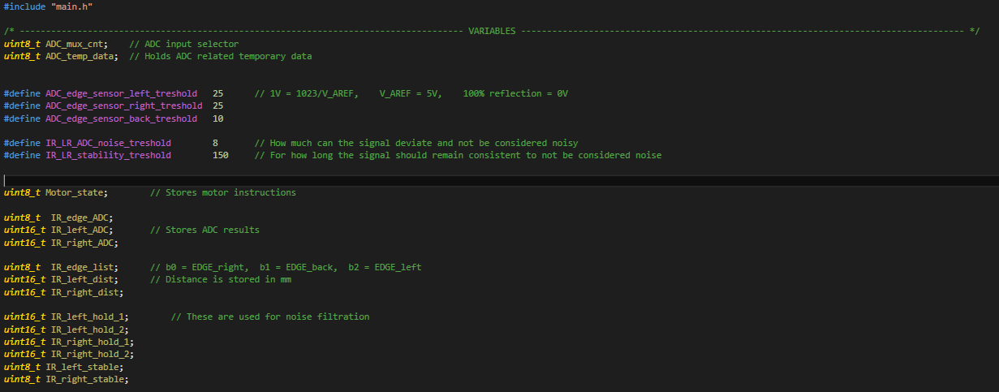
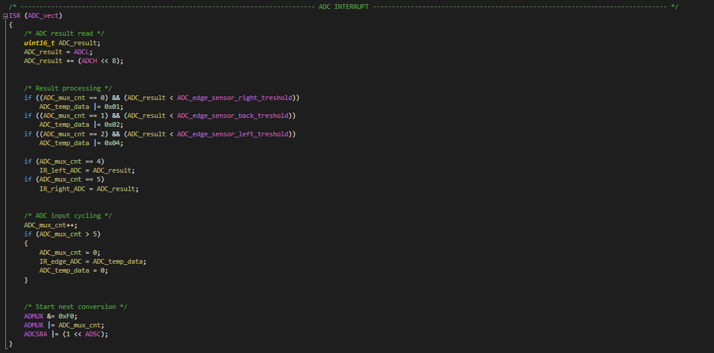
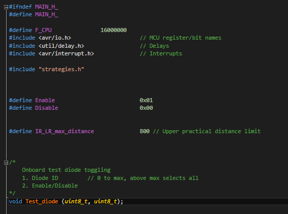

# Programmējums
Zondes borta datora (mikrokontroliera) programmējums

# Programmēšanas stila vadlīnijas
Šīs ir tikai vadlīnijas, nesitīšu ja perfekti nesekosiet tām. Galvenais, lai kods ir saprotams un pārskatāms
- Tabulācija ir 4 atstarpes
- Komentārus var latviski/english, galvenais lai ir saprotami un labi apraksta kodu
- Iesaku komentārus netaupīt, tiklīdz kaut kas liekas ne pilnīgi pašsaprotams, raksti komentāru
- Komentāru garumam nevajadzētu pārsniegt 2 - 3 līnijas

## Mainīgo noformējums

- Mainīgo nosaukums var būt īsi līdz vidēji tekstuāls, galvenais lai no nosaukuma ir aptuveni skaidrs, kur izmanto
- Visim mainīgiem ir jābūt definētiem vienā vietā (vai divās) un, kur nepieiciešams, ar komentāriem aprakstīts to pielietojums
- Šīs pašas vadlīnijas arī attiecas uz definētām konstantēm
- Lūgums turēt mainīgos ārpus header (main.h) faila, cik iespējams (Uz konstantēm tas neattiecas)

## Koda noformējums

- Galvenā doma ir sadalīšana pa blokiem ar attiecīgām komentētām sadalēm
- Piemērā ir redzams ADC pārtraukums kā galvenais bloks, ar iekšējiem darbības soļiem sadalītiem mazākos blokos
- Var dalīt kodu pa blokiem arī pēc saviem ieskatiem, galvenais lai ir labi sadalīts

## #include un funkcijas

- Pie #include droši rakstiet komentārus
- Funkcijām lūdzu veidot aprakstu, pasakot ko dara, ko ievada (ar mainīgo aprakstu) un ko izvada
- Ja izmantojat gatavus koda blokus no citiem avotiem, tos iesaku turēt atsevišķos failos un integrēt kā funkcijas

# Git bash konfigurācija un lokālās repozitorijas izveide

### 1. Instalē git bash

### 2. Izveido mapi, kurā glabās projektu

### 3. R-click(otrais peles taustiņš) -> Git bash here
  - Ja nerāda, atver git bash un ar cd navigē uz izveidoto mapi

### 4. Konsolē: git config --global user.name "Vards Uzvards" 
- git config --global user.email "epasts@mail.com"
  - Izmanto to epastu, kurš piesaistīts profilam, kas var tikt klāt IRBE5 repozitorijai
  - Var pārbaudīt, vai pareizi saglabāts ar tām pašām komandām, noņemot "" specificētos datus

   
### 5. (Neobligāts)Konsolē: git config --global core.editor "'C:/Program Files/Notepad++/notepad++.exe' -multiInst -notabbar -nosession -noPlugin"
  - var uzstādīt notepad++ kā default teksta editoru, kad raksta commit komentāru
  - Iesaku izdarīt, jo konsoles teksta editors nav ērts

### 6. Konsolē: git config --global init.defaultBranch main
- Citādi defaults būs master, un tas var radīt problēmas

### 7. Konsolē: git config --list
- Ar šo var pārbaudīt git bash konfigurāciju

### 8. Beidzot inicializē lokālo repozitoriju: git init

# Darbība ar lokālo github repositoriju

### 1. Konsolē: git remote add IRBE5 https://github.com/VEA-IRBE5/Programmejums.git
- turpmāk pie git pull var izmantot IRBE5 nevis pilno linku 
- ar šo pastās, vai sarakstā ir Konsolē: git remote -v

### 2. Konsolē: git pull IRBE5 [Branch name]
- Lejupielādē norādītā zara saturu no repozitorijas, par zaru lietošanu konsultējies ar nodaļas galveno

### 3. Pēc pašreizējās darba tūres beigšanas neaizmirsti izveidot commit, lai dati nepazūd
- Konsolē: git add . (vai git add "filename", ja negrib visas izmaiņas pievienot)
- Konsolē: git status (pastās, vai viss ir ok)
- Konsolē: git commit (Lūdzu izsmeļoši un ne pārāk gari aprakstiet izmainīto)(var izmantot: -m "Text here")
   
### 4. Kad liekas, ka pašreizējais uzdevums ir gana labā stāvoklī, Konsolē: git push IRBE5 [Branch name]
